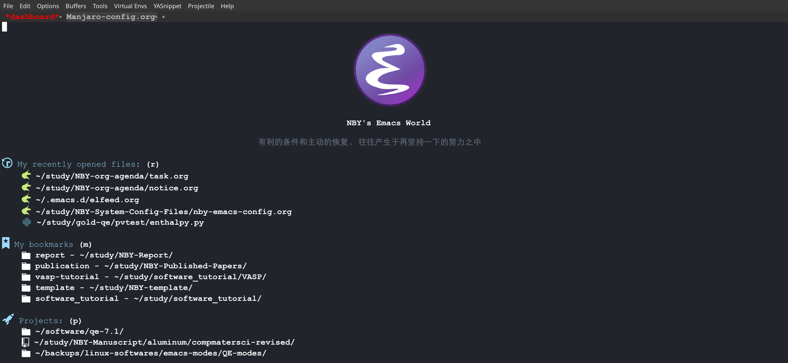

#+title: Bo-Yuan Ning's Site
#+author: Bo-Yuan Ning (宁博元)
# #+options: num:nil
#+setupfile: ./source/org/theme-readtheorg.setup
# #+REVEAL_MATHJAX_URL: /home/nby/software/MathJax-master/es5/tex-chtml-full.js
#+HTML_HEAD: 
* Who am I and what I do?

I am a physics lover and working as a faculty scientist at /Shanghai Institute of Applied Physics/ (SINAP), Chinese Academy of Sciences.
The big picture here is to build up the Thorium-based molten salt reactor (TMSR), which is one of state-of-the-art 4th-generation nuclear fission reactors.

While I do quite enjoy carrying out experimental works,
my main research field is theoretical condensed-matter physics
and at present I am focusing on applying statistical mechanics approaches to investigate the
thermodynamic and mechanical properties of
realistic materials under high temperature-pressure and high-irradiation extreme conditions.

You may find my academic experience in my [[file:CV/byning_cv.pdf][Curriculum Vitae]].

@@html:

@@
  #+html_export:  
  #+html_export:  
  #+html_export:  
  #+CAPTION: 2022-07-22@peak of the Jiuxian Mountain(九仙山), Rizhao, Shangdong Province. A vacation with my best friend.
  #+ATTR_HTML: :width 67%
  #+ATTR_HTML: style float:center
  
  
* Current Research Fields
** Phase Stability of Metals/Alloys under Extreme Conditions
** Mechanical Properties of Solids
** Creep Rate of High-End Alloys

# \begin{eqnarray}
# $$\mathcal{Z}&=&\frac{1}{N!h^{3N}}\int d\vec{\textbf{p}}^N\int d\vec{\textbf{q}}^N\exp\{-\beta[\sum_{i=1}^{N}\frac{\vec{\textbf{p}}_i^2}{2m}+U(\vec{\textbf{q}}^N)]\} \\
# &=&\frac{1}{N!}\left(\frac{2\pi m}{\beta h^2}\right)^{\frac{3}{2}N}\int d\vec{\textbf{q}}^N\exp[-\beta U(\vec{\textbf{q}}^N)]$$
# \end{eqnarray}
\begin{equation*}
\mathcal{Q}=\int d\vec{\textbf{q}}^N\exp[-\beta U(\vec{\textbf{q}}^N)] \longrightarrow {\text{Configurational Integral} (3N\text{-dimensional})}
\end{equation*}
* News
  - Presentation in 2022 CPS Annual Meeting @ SUSTech, Shenzhen, China (11.18-11.20.2022).
    - [[file:talks/2022-comput-physic/report/report.html][A new method to predict phase transition and EOS of solid materials]]
#    - [[file:talks/2022-cps/comput-phys/report/report.html][A new method to predict phase transition and EOS of solid materials]] (Computational Physics Section, slides in Chinese)
    # - [[file:takls/2022-cps/statis-phys/report/report.html][A new method to solve the partition function of condensed-matter systems---DIA]] (Statistical Physics Section, slides in Chinese)

* Publication List
#+begin_export html

    <ul>
	<ul> <strong>Preprint</strong>
	    <li>Equation of state for tungsten predicted by ensemble theory, Yue-Yue Tian, <em><strong>Bo-Yuan Ning</strong></em>, X.-D. Xiang, Hui-Fen Zhang*, Xi-Jing Ning&#8224, arXiv:<strong>2210.16736</strong>(2022).</li>
	</ul>
	<ul> <strong>Published</strong>
	    <li>An <em>ab initio</em> study of structural phase transitions of crystalline aluminium under ultrahigh pressures based on ensemble theory, <em><strong>Bo-Yuan Ning*</strong></em>, Li-Yuan Zhang, <em><strong>Computational Materials Science</strong></em>, 218, 111960(2023).</li>
	    <li>Pressure-induced structural phase transitions of zirconium: An <em>ab initio</em> study based on statistical ensemble theory, <em><strong>Bo-Yuan Ning*</strong></em>, <em><strong>Journal of Physics: Condensed Matter</strong></em>, 34, 505402(2022).</li>
	    <li>Pressure-induced structural phase transition of vanadium: A revisit from the perspective of ensemble theory,  <em><strong>Bo-Yuan Ning</strong></em>, Xi-Jing Ning*, <em><strong>Journal of Physics: Condensed Matter</strong></em>, 34, 425404(2022).</li>
	    <li>Efficient approaches to solutions of partition function for condensed matters, <em><strong>Bo-Yuan Ning</strong></em>, Le-Cheng Gong, Tsu-Chien Weng*, Xi-Jing Ning&#8224, <em><strong>Journal of Physics: Condensed Matter</strong></em>, 33, 115901(2021).</li>
	    <li>Which phase of Ta2O5 being of the largest dielectric constant?, Hui-Fen Zhang, <em><strong>Bo-Yuan Ning</strong></em>, Tsu-Chien Weng, Xi-Jing Ning*, <em><strong>Journal of American Ceramics Society</strong></em>, 104, 6413(2021).</li>
	    <li>How accurate for phonon models to predict the thermal dynamical properties of crystals, Le-Cheng Gong, <em><strong>Bo-Yuan Ning</strong></em>, Chen Ming, Tsu-Chien Weng, Xi-Jing Ning*, <em><strong>Journal of Physics: Condensed Matter</strong></em>, 33, 085901(2020).</li>
	    <li>Comparison of two efficient methods for calculating partition functions, Le-Cheng Gong, <em><strong>Bo-Yuan Ning</strong></em>, Tsu-Chien Weng, Xi-Jing Ning*, <em><strong>Entropy</strong></em>, 21, 1050(2019).</li>
	    <li>A new model to predict optimum conditions for growth of 2D materials on a substrate, Yu-Peng Liu, <em><strong>Bo-Yuan Ning</strong></em>, Le-Cheng Gong, Tsu-Chien Weng, Xi-Jing Ning*, <em><strong>Nanomaterials</strong></em>, 9, 978(2019).</li>
	    <li>What retards the response of graphene based gaseous sensor, Hui-Fen Zhang, <em><strong>Bo-Yuan Ning</strong></em>, Tsu-Chien Weng, Dong-Ping Wu*, Xi-Jing Ning&#8224, <em><strong>Sensors and Actuators A: Physical</strong></em>, 295, 188(2019).</li>
	    <li>A diffusion model for solute atoms diffusing and aggregating in nuclear structural materials, Quan Song, Fan-Xin Meng, <em><strong>Bo-Yuan Ning</strong></em>, Jun Zhuang, Xi-Jing Ning*, <em><strong>Chinese Physics B</strong></em>, 26, 126601(2017).</li>
	    <li>Rapidly calculating the partition function of macroscopic systems, Jing-Tian Li, <em><strong>Bo-Yuan Ning</strong></em>, Le-Cheng Gong, Jun Zhuang, Xi-Jing Ning*, <em><strong>Chinese Physics B</strong></em>, 26, 030501(2017).</li>
	    <li>Electronic band structure and sub-band-gap absorption of Nitrogen hyperdoped Silicon, Zhen Zhu, Hezhu Shao, Xiao Dong, Ning Li, <em><strong>Bo-Yuan Ning</strong></em>, Li Zhao, Jun Zhuang*, <em><strong>Scientific Reports</strong></em>, 5, 10513(2015).</li>
	    <li>Site-selective substitutional doping with atomic precision on stepped Al (111) surface by single-atom manipulation, Chang Chen, Jinhu Zhang, Guofeng Dong, Hezhu Shao, <em><strong>Bo-Yuan Ning</strong></em>, Li Zhao, Xi-Jing Ning, Jun Zhuang*, 9, 235, <em><strong>Nanoscale Research Letters</strong></em>(2014).</li>
	    <li>Hybrid functional studies on impurity-concentration-controlled band engineering of Chalcogen-Hyperdoped silicon, Hezhu Shao, Cong Liang, Zhen Zhu, <em><strong>Bo-Yuan Ning</strong></em>, Xiao Dong, Xi-Jing Ning, Li Zhao, Jun Zhuang*, <em><strong>Applied Physics Express</strong></em>, 6, 085801(2013).</li>
	    <li>Reliable lateral atom manipulation by thermal activation on metal fcc(001) surfaces, Jinhu Zhang, Chang Chen, <em><strong>Bo-Yuan Ning</strong></em>, Hezhu Shao, Li Zhao, Xi-Jing Ning, Jun Zhuang*, <em><strong>Journal of The Physical Society of Japan</strong></em>, 82, 104602(2013).</li>
	    <li>Physical mechanisms for the unique optical properties of chalcogen-hyperdoped silicon, Hezhu Shao, Yuan Li, Jinhu Zhang, <em><strong>Bo-Yuan Ning</strong></em>, Wenxian Zhang, Xi-Jing Ning, Li Zhao, Jun Zhuang*, <em><strong>Europhysics Letters</strong></em>, 99, 46005(2012).</li>
	    <li>Manipulating dipolar and spin-exchange interactions in spin-1 Bose-Einstein condensates, <em><strong>Bo-Yuan Ning</strong></em>, S. Yi, Jun Zhuang, J. Q. You, Wenxian Zhang*, <em><strong>Physical Review A</strong></em>, 85, 053646 (2012).</li>
	    <li>Enhancement of spin coherence in a spin-1 Bose-Einstein Condensate by dynamical decoupling approaches, <em><strong>Bo-Yuan Ning</strong></em>, Jun Zhuang, J. Q. You, Wenxian Zhang*, <em><strong>Physical Review A</strong></em>, 84, 013606(2011).</li>
	    <li>Realization of quantum single pendulum on macroscopic level, <em><strong>Bo-Yuan Ning</strong></em>, Jun-Shan Ma, Jun Zhuang, Xi-Jing Ning*, <em><strong>Acta Physica Sinica</strong></em>, 59, 1456(2010).</li>
	</ul>
    </ul>

 
#+end_export
* Useful Links for Emacs
I am a deeply heavy user of Emacs,
the software of which disguises itself as an old-school text editor at first glance,
while, as far as in my viewpoint, is actually a powerful pseudo /OPERATING SYSTEM/
that works on top of Windows, Mac and, of course, Linux with its best performance and compatibility.
About 80% of my workflow is completed within Emacs, and, 
as a matter of fact, it is possible to do everything within Emacs
besides writing programs as an IDE or plain paperwork,
/e.g.,/ web browsing, reading PDF files, scanning RSS feeds, git repository, receiving & sending Emails, making presentation slides,
listening music, watching video, ssh remote server, desktop window management etc.,
which leads to the famous saying --- Living in Emacs.
In case that you have not noticed yet, this web page is created by using Org Mode in Emacs ([[https://github.com/fniessen/org-html-themes][org-html-themes]]).
Although I strongly recommend Emacs to those whose works are closely related to theoretical physics, numerical computations or writing programs, 
there are other options of 'text editor' worthy taking a shot, /e.g.,/ Vim, VScode, Atom (now as Pulsar), Sublime, etc.
Yes, you are right, I literally know nothing about Vim.

 #+CAPTION: A snap shot of the startup page of my configured Emacs.
 #+ATTR_HTML: :width 1000px height 800px
 #+ATTR_HTML: style float:center

The followings are some very useful sites or introduction videos where you can learn how to use Emacs as well as study the sexy and elegant Elisp language.
** Website
- [[https://www.emacswiki.org/emacs/EmacsWiki][Emacs WiKi]]
- [[https://www.youtube.com/@SystemCrafters][System Crafters@YT Channel]] (strongly recommended)
- [[https://www.youtube.com/@XahLee][Xah Lee@YT Channel]] ([[http://xahlee.info/emacs/index.html][Emacs site of Xah Lee]])
- [[https://sachachua.com/blog/][Sacha Chua]]
- [[https://www.youtube.com/@mzamansky][Mike Zamansky@YT Channel]]
- [[https://www.youtube.com/@DistroTube][DistroTube@YT Channel]]
- [[https://www.youtube.com/@protesilaos][Protesilaos Stavrou@YT Channel]]
- [[https://melpa.org/][melpa.org]] (one of Emacs packages sites)
- [[https://orgmode.org/org.html#Export-settings][Org-mode Manual]]
- [[https://emacs-china.org/][Emacs China Forum]]
** Introduction Videos
- [[https://www.youtube.com/watch?v=gfZDwYeBlO4&list=PLXFkuTmMVeliSIgYFgmBSNcZFmAdPBABn&index=9&t=3653s][Play Emacs Like An Instrument]] by Alain M. Lafon
- [[https://www.youtube.com/watch?v=SzA2YODtgK4&list=PLXFkuTmMVeliSIgYFgmBSNcZFmAdPBABn&index=6][Getting Started with Org Mode]] by Harry Schwartz
- [[https://book.emacs-china.org/#org8cf0b9f][21天学会Emacs]] by 子龙仙人

* Some Quotations May Be for You and Me
After the beginning three years of graduate-student period,
I went through a ten-year-long hard time for developing new methods aiming at solving the many-electron problem (2013-2015) and many-body partition function (2015-2021),
which was severely struggling but rather precious for me.
I am glad I finally overcame the difficulties from various aspects and
now have special feelings about the following quotations,
which, I hope, can be insightful as well for whoever arrives here.
I sincerely wish those who are /TRUE IDEALIST/ can fulfill their dreams eventually.

- "Great spirits have always encountered violent opposition from mediocre minds.
   The mediocre mind is incapable of understanding the man who refuses to bow blindly to conventional prejudices and
   choose instead to express his opinions courageously and honestly." ⋅ Albert Einstein

- "Hope is a good thing, maybe the best of things. And no good thing ever dies" ⋅ Andy Dufresne (<The Shawshank Redemption>)

- "The most important tool of the theoretical physicist is his wastebasket" ⋅ Albert Einstein

- "There are two ways of doing calculations in theoretical physics,
   One way, and this is the way I prefer, is to have a clear physical picture of the process that you are calculating.
   The other way is to have a precise and selfconsistent mathematical formalism." ⋅ Erico Fermi (<A meeting with Enrico Fermi> by F.Dyson)

- "老当益壮，宁移白首之心？穷且益坚，不坠青云之志。" ⋅ 王勃 (<滕王阁序>)

- "天下有大勇者，卒然临之而不惊，无故加之而不怒。此其所挟持者甚大，而其志甚远也" ⋅ 苏轼 (<留侯论>)

- "谨以此书献给那些在科学高峰的攀登中持之以恒、不畏险阻的勇士们！" ⋅ 刘辽 (<广义相对论> ⋅ 扉页)

- "有利的条件和主动的恢复, 往往产生于再坚持一下的努力之中。" ⋅ 毛泽东

* Contact Info

Office Location: No.2019 Jialuo Road, Shanghai 201800

Email: /[[mailto:ningboyuan@sinap.ac.cn][ningboyuan@sinap.ac.cn]]/

* Job Information

** Graduate Student

** Postdoc Position
